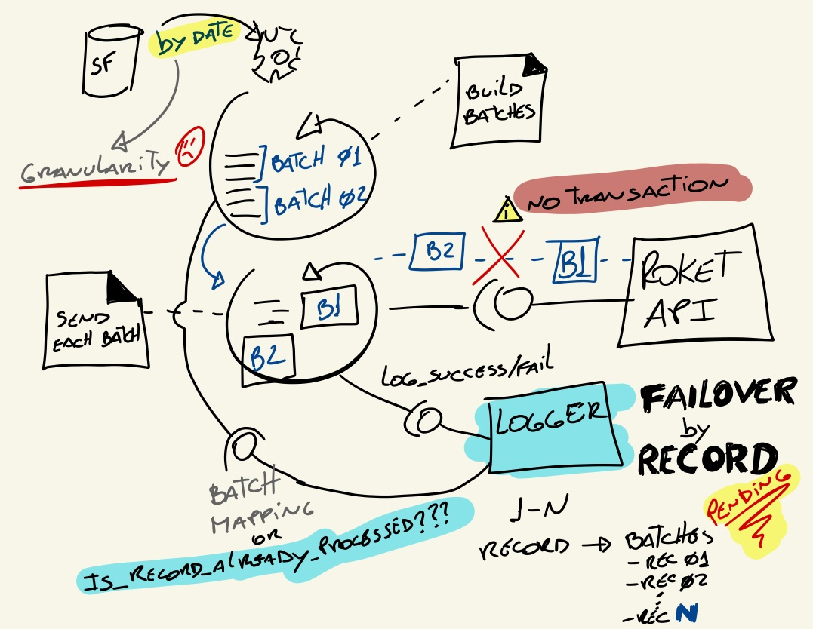

# Roket upload data failover options
**Source**: Snowflake
- Query filters by date: this controls duplication form the datasource

**Sink**: Roket API
- Does not dedup records

## Problem
- Daily job
- No dedup available in the sink.
- There are a granularity disconnection, the sink doesnt accept more than 100 records per batch:
```
source(N records) -> sink(n_records_batches)
```
- No transaction on API level.

Due the scenario describe above there is the possibility of partial uploads and since there is not tracking of the records 
included in each batch and which batches succeded/failed, reprocess the same `date` will regenerate all batches independently 
any of them, and their records, were previously successfully uploaded.  

**The solution is related to traceability.**


## Proposed solutions  
To implement proper failover it is necessary to track progress of records processed.

### Candidate Solution 1: New Logger feature - Log by db records and record groups
Logger is the designed solution for traceability in `Data Echange`. This option proposes the `Logger` extension to keep 
tracking of each **database** record processed.



#### Pros
- Add a new feature already planned(make progress on `Logger` roadmap)
- Can be easily reused by future and legacy `DAGs`

#### Cons
- It is a more complex implementation since it is related to some core source code.
- It will take longer. It will require exhaustive validation/test.

### Candidate Solution 2: Workaround - Mimic file logger pre-requisite
This option proposes to add a intermediate step to generate batch files from the database query result.
The extra step will allow achieving traceability using the `Logger` current already implemented features.


#### Pros
- No core source code changes. Easier implementation. 
- Quicker implementation.

#### Cons
- Job specific. Can not be easily reused.
- It will duplicate a capability already planned to be in different component.

### Candidate Solution 3: Workaround - Manual failover

Keep traceability records under a different storage like S3.  
Allow DAG to pick specific files from S3 logs.

#### Pros
- No core source code changes. Easier implementation.
- Even Quicker implementation than the previous ones.

#### Cons
- Job specific. Can not be easily reused.
- Manual/semi-manual failover. 


